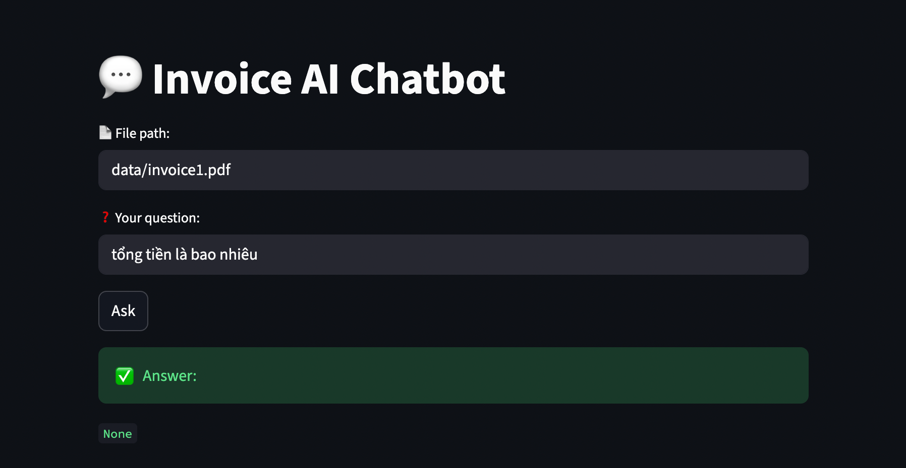

# 🚀 Invoice AI Chatbot

## 🇻🇳 Giới thiệu

**Invoice AI Chatbot** là hệ thống xử lý hóa đơn end-to-end, cho phép:

* 📄 đọc file PDF
* 🔍 trích xuất nội dung bằng OCR
* 🧠 lấy thông tin quan trọng (tổng tiền, ngày, ...)
* 💬 hỏi đáp trực tiếp qua chatbot

👉 project mô phỏng một hệ thống AI thực tế trong doanh nghiệp (kế toán / tài chính)

---

## 🇬🇧 Overview

**Invoice AI Chatbot** is an end-to-end system that:

* Processes invoice PDFs
* Extracts text using OCR
* Retrieves key information (total amount, date, etc.)
* Provides a chatbot interface for querying invoice data

👉 This project simulates a real-world AI system used in accounting and financial workflows.

---

## 🧠 System Architecture

        PDF
         ↓
        OCR
         ↓
     Clean Text
         ↓
  Extract Information
         ↓
      FastAPI
         ↓
     Chatbot API
         ↓
     Streamlit UI

---

## ✨ Features

* 📄 Upload invoice (PDF)
* 🔍 OCR text extraction
* 🧠 Information extraction (total, date)
* 💬 Rule-based chatbot
* 🌐 Interactive UI (Streamlit)
* 🐳 Dockerized deployment

---

## 🛠️ Tech Stack

* **Backend:** FastAPI
* **Frontend:** Streamlit
* **Language:** Python
* **OCR:** PDF text extraction
* **Deployment:** Docker

---

## 📦 Project Structure

invoice-ai/
├── app.py                  # Streamlit UI
├── main.py                 # FastAPI backend
├── services/
│   ├── ocr_service.py
│   ├── extract_service.py
│   └── chat_service.py
├── data/
├── Dockerfile
├── requirements.txt
└── README.md

---

## 🚀 How to Run

### 🔹 Run locally

git clone https://github.com/trantthuyhuong10/invoice-ai-project-2026.git
cd invoice-ai

python3 -m venv venv
source venv/bin/activate

pip install -r requirements.txt

uvicorn main:app --reload
streamlit run app.py

👉 API Docs: http://localhost:8000/docs
👉 UI: http://localhost:8501

---

### 🐳 Run with Docker

docker build -t invoice-ai .
docker run -p 8000:8000 invoice-ai

---

## 💬 Example Queries

* “Tổng tiền là bao nhiêu?”

---

## 📸 Demo

---

## 🔍 Key Highlights 

* Designed a modular AI pipeline (OCR → extraction → chatbot)
* Built RESTful APIs using FastAPI
* Developed a simple NLP chatbot without external LLMs
* Integrated frontend (Streamlit) with backend APIs
* Containerized the application using Docker

---

## 📈 Future Improvements

* Improve OCR accuracy
* Extract more fields (company, tax code, items)
* Add chat history UI
* Deploy to cloud (Render / Railway)
* Integrate LLM for smarter Q&A

---

## 👤 Author

trantthuyhuong10

---

## ⭐ Final Note

This project demonstrates the ability to build a complete AI-powered system, from data processing to API and UI deployment — not just model training.
